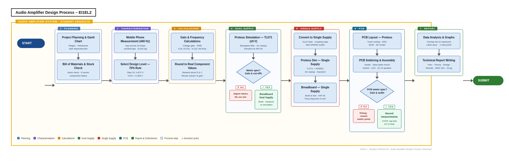

# Documentation: Two-Stage Audio Amplifier

Full technical reference for the two-stage audio amplifier project. Covers system architecture, stage-by-stage design, simulation, PCB layout, build process, measured results and bill of materials.

> Back to [README.md](README.md) &nbsp;|&nbsp; [media/GALLERY.md](media/GALLERY.md) &nbsp;|&nbsp; [report/audio-amplifier-report.pdf](report/audio-amplifier-report.pdf)

---

## Table of Contents

- [1. Project Overview](#1-project-overview)
- [2. Repository Structure](#2-repository-structure)
- [3. System Architecture](#3-system-architecture)
- [4. Design Specification](#4-design-specification)
- [5. Stage 1: Active Band-Pass Filter](#5-stage-1-active-band-pass-filter)
  - [5.1 Theory](#51-theory)
  - [5.2 TL071 Op-Amp](#52-tl071-op-amp)
  - [5.3 Cutoff Frequency Design](#53-cutoff-frequency-design)
  - [5.4 Voltage Gain](#54-voltage-gain)
- [6. Stage 2: Unity-Gain Power Buffer](#6-stage-2-unity-gain-power-buffer)
  - [6.1 OPA551 Op-Amp](#61-opa551-op-amp)
  - [6.2 Buffer Configuration](#62-buffer-configuration)
- [7. Single-Supply Design](#7-single-supply-design)
- [8. Proteus Simulation](#8-proteus-simulation)
  - [8.1 Schematic](#81-schematic)
  - [8.2 Frequency Response Simulation](#82-frequency-response-simulation)
  - [8.3 Time-Domain Analysis](#83-time-domain-analysis)
- [9. PCB Design](#9-pcb-design)
  - [9.1 Layout](#91-layout)
  - [9.2 3D Model](#92-3d-model)
- [10. Build and Test](#10-build-and-test)
  - [10.1 Breadboard Prototype](#101-breadboard-prototype)
  - [10.2 PCB Assembly](#102-pcb-assembly)
  - [10.3 Oscilloscope Measurements](#103-oscilloscope-measurements)
- [11. Results](#11-results)
- [12. Bill of Materials](#12-bill-of-materials)
- [13. License](#13-license)
- [14. Attribution](#14-attribution)

---

## 1. Project Overview

The two-stage audio amplifier takes a line-level audio signal from a mobile phone headphone output and drives an 8 Ω speaker at a target output voltage of 3 Vpp. The design was completed from initial hand calculations through Proteus SPICE simulation, breadboard prototyping on both dual and single supply, and a final PCB implementation.

The circuit uses two operational amplifiers in cascade. The first stage provides frequency selectivity and voltage gain. The second stage provides current drive capability without adding gain, allowing the amplifier to power an 8 Ω load directly.

The audio source used throughout the project was an iPhone 14 Pro Max, characterised at 440 Hz with a measured output of 0.872 Vpp.

---

## 2. Repository Structure

```
two-stage-audio-amplifier/
├── README.md                       Project overview and quick links
├── DOCUMENTATION.md                Full technical reference (this file)
├── CONTRIBUTING.md                 Commit and workflow standards
├── LICENSE                         MIT license
│
├── .github/
│   └── ISSUE_TEMPLATE/
│       ├── bug_report.md           Bug report template
│       └── docs_update.md          Documentation update template
│
├── design/
│   ├── calculations/               Design calculation workbooks
│   │   ├── Audio Amplifier Design Calculations.xlsx
│   │   ├── audio-amp-design-workbook.xlsx
│   │   └── frequency-response-data.xlsx
│   └── proteus/
│       └── exports/                PNG exports from Proteus
│
├── media/
│   ├── images/                     Circuit figures and PCB photographs
│   ├── block-diagrams/             System block diagrams and flowcharts
│   └── GALLERY.md                  Curated image gallery
│
└── report/
    └── audio-amplifier-report.pdf  Full technical report (PDF)
```

---

## 3. System Architecture

The signal path through the amplifier is as follows:

**iPhone audio out → Stage 1 (TL071 active band-pass filter) → Stage 2 (OPA551 power buffer) → 8 Ω speaker**

<p align="center">
  
</p>

The mobile phone and speaker sit outside the system boundary as external components. Stage 1 handles frequency shaping and voltage gain. Stage 2 handles current drive. The two-stage approach allows each op-amp to be optimised for its role: the TL071 is chosen for its audio-band linearity and low noise, the OPA551 for its high output current capability.

<p align="center">
  
</p>

---

## 4. Design Specification

| Parameter | Value |
|---|---|
| Input source | iPhone 14 Pro Max (3.5 mm audio) |
| Input voltage | 0.872 Vpp at 440 Hz |
| Output voltage target | 3 Vpp |
| Speaker load | 8 Ω |
| Lower cutoff frequency (fL) | 5 Hz |
| Upper cutoff frequency (fH) | 28.54 kHz |
| Bandwidth | 28.535 kHz |
| Stage 1 IC | TL071CP |
| Stage 2 IC | OPA551PA |
| Feedback resistor (R5) | 82 kΩ |
| Supply configuration | Single supply (final design) |

---

## 5. Stage 1: Active Band-Pass Filter

### 5.1 Theory

An active band-pass filter combines a high-pass and a low-pass response in a single amplifier stage. The lower cutoff frequency (fL) is set by the high-pass RC network at the input. The upper cutoff frequency (fH) is set by the low-pass RC network in the feedback path. Frequencies between fL and fH pass through with gain; frequencies outside this range are attenuated at 20 dB per decade.

<p align="center">
  
</p>

Using an op-amp rather than passive components (resistors and capacitors alone) provides a non-zero output impedance and allows the filter to drive a subsequent stage without loading affecting the frequency response.

<p align="center">
  
</p>

<p align="center">
  
</p>

### 5.2 TL071 Op-Amp

<p align="center">
  
</p>

The TL071CP is a single JFET-input operational amplifier. Key characteristics relevant to this application:

- JFET input stage provides high input impedance and low input bias current, minimising loading on the audio source
- Gain-bandwidth product of 3 MHz, sufficient to maintain accuracy across the 28.54 kHz upper cutoff frequency
- Slew rate of 13 V/µs, well above the requirement for a 3 Vpp signal at 28.54 kHz
- Supply range of ±2 V to ±18 V (or equivalent single supply up to 36 V)
- Low offset voltage suitable for audio-frequency applications

### 5.3 Cutoff Frequency Design

The lower cutoff frequency is set by R2 and C2:

```
fL = 1 / (2π × R2 × C2)    target: 5 Hz
```

The upper cutoff frequency is set by R1 and C1:

```
fH = 1 / (2π × R1 × C1)    target: 28.54 kHz
```

Component subscripts match the schematic designators used throughout this project. The exact calculated values for R1, R2, C1 and C2 are in `design/calculations/Audio Amplifier Design Calculations.xlsx`.

### 5.4 Voltage Gain

The midband voltage gain is set by the ratio of the feedback resistor (R5 = 82 kΩ) to the input resistor. The target gain brings the 0.868 Vpp input up to 3 Vpp at the Stage 1 output.

Measured at 440 Hz on the completed PCB: input 0.868 Vpp, output 3.000 Vpp — gain of approximately 3.46.

---

## 6. Stage 2: Unity-Gain Power Buffer

### 6.1 OPA551 Op-Amp

<p align="center">
  
</p>

The OPA551PA is a high-voltage, high-current operational amplifier. Key characteristics:

- Continuous output current up to ±200 mA, well above the requirement for 3 Vpp across 8 Ω (approximately 375 mA peak)
- Wide supply range: up to ±30 V
- Built-in thermal shutdown protection
- Unity-gain stable
- Designed for driving low-impedance loads such as speakers and motors directly

### 6.2 Buffer Configuration

Stage 2 is configured as a unity-gain voltage follower (output connected directly to the inverting input). The output voltage equals the input voltage at all frequencies within the op-amp bandwidth. No additional gain is introduced; the sole purpose of this stage is to provide the current drive that Stage 1 cannot supply into an 8 Ω load.

Measured at 440 Hz on the completed PCB: input 0.872 Vpp, output 2.980 Vpp — confirming unity gain to within measurement precision.

---

## 7. Single-Supply Design

The initial breadboard prototype used a symmetric dual supply (±V). The final design operates from a single supply rail to simplify the power requirements.

For single-supply operation the TL071 requires a bias network to establish a virtual mid-supply reference:

- R3 and R4 form a voltage divider biasing the non-inverting input of the TL071 to Vcc/2
- The op-amp output then swings above and below this mid-rail reference
- DC offset is present at the output due to the bias voltage

During oscilloscope measurements a 470 nF capacitor was used as an AC-coupling element to remove the DC offset and display the AC signal cleanly. This capacitor is external to the circuit and used for measurement purposes only.

---

## 8. Proteus Simulation

### 8.1 Schematic

The full circuit was drawn in Proteus schematic capture before simulation or PCB layout. Both stages, the single-supply bias network and all passive components are shown.

<p align="center">
  
</p>

### 8.2 Frequency Response Simulation

The frequency response was simulated using Proteus SPICE frequency sweep analysis. 501 data points were captured across the audio band to produce smooth curves. Simulation data was exported to Excel and plotted alongside breadboard and PCB measured data for direct comparison.

<p align="center">
  
</p>

<p align="center">
  
</p>

The combined frequency response chart in `design/calculations/frequency-response-data.xlsx` contains four data series: Stage 1 simulation, Stage 2 simulation, breadboard measured data and PCB measured data.

### 8.3 Time-Domain Analysis

Time-domain simulation at 440 Hz was used to verify output waveform shape and amplitude for both stages.

<p align="center">
  
</p>

<p align="center">
  
</p>

Note: the OPA551 SPICE model in Proteus does not simulate the Stage 2 buffer output correctly in time-domain analysis at 440 Hz. A workaround was applied for the relevant figures; the frequency-domain simulation and all measured results are unaffected.

---

## 9. PCB Design

### 9.1 Layout

The PCB was designed in Proteus PCB layout following schematic capture. Both the top and bottom copper layers are used. Components are placed to minimise trace lengths for the signal path and to keep decoupling capacitors close to the op-amp supply pins.

<p align="center">
  
</p>

<p align="center">
  
</p>

### 9.2 3D Model

Proteus generates a 3D model from the PCB layout. Three views are shown below.

<p align="center">
  
  &nbsp;
  
</p>

<p align="center">
  
  &nbsp;
  
</p>

---

## 10. Build and Test

### 10.1 Breadboard Prototype

The circuit was first built on breadboard using a symmetric dual supply to verify the design before adapting for single supply.

<p align="center">
  
</p>

The design was then adapted for single-supply operation by adding the bias network and verified on breadboard before PCB manufacture.

<p align="center">
  
</p>

### 10.2 PCB Assembly

The manufactured PCB was populated with components and mounted using M3 nylon standoffs.

<p align="center">
  
  &nbsp;
  
</p>

<p align="center">
  
  &nbsp;
  
</p>

### 10.3 Oscilloscope Measurements

Measurements were taken at 440 Hz using a TBS1052C oscilloscope. A 470 nF capacitor was connected in series with the oscilloscope probe to AC-couple the measurement and remove the DC bias offset present in the single-supply design.

**Stage 1 output at 440 Hz (PCB):**

<p align="center">
  
</p>

**Stage 2 output at 440 Hz (PCB):**

<p align="center">
  
</p>

---

## 11. Results

### 11.1 PCB Measurements at 440 Hz

| Stage | Input | Output | Notes |
|---|---|---|---|
| Stage 1 (TL071 active filter) | 0.868 Vpp | 3.000 Vpp | Meets 3 Vpp target exactly |
| Stage 2 (OPA551 buffer) | 0.872 Vpp | 2.980 Vpp | Unity gain confirmed |

### 11.2 Performance Summary

| Parameter | Calculated | Simulated | Breadboard (dual) | Breadboard (single) | PCB |
|---|---|---|---|---|---|
| Stage 1 output at 440 Hz | 3.0 Vpp | — | — | — | 3.000 Vpp |
| Stage 2 output at 440 Hz | 3.0 Vpp | — | — | — | 2.980 Vpp |
| Lower cutoff fL | 5 Hz | — | — | — | — |
| Upper cutoff fH | 28.54 kHz | — | — | — | — |

Full comparison table with calculated, simulated and measured data across all four test configurations is in `design/calculations/frequency-response-data.xlsx` and in the [full technical report](report/audio-amplifier-report.pdf).

### 11.3 Frequency Response

<p align="center">
  
</p>

The amplifier passband (5 Hz to 28.54 kHz) covers the full range of human hearing (approximately 20 Hz to 20 kHz) with margin at both ends.

<p align="center">
  
</p>

---

## 12. Bill of Materials

| Designator | Component | Value / Part | Purpose |
|---|---|---|---|
| U1 | Op-amp | TL071CP | Stage 1 — inverting active band-pass filter |
| U2 | Op-amp | OPA551PA | Stage 2 — unity-gain power buffer |
| R1 | Resistor | Sets fH with C1 | Upper cutoff high-pass element |
| R2 | Resistor | Sets fL with C2 | Lower cutoff low-pass element |
| R3 | Resistor | Voltage divider | Single-supply bias network |
| R4 | Resistor | Voltage divider | Single-supply bias network |
| R5 | Resistor | 82 kΩ | Feedback — sets midband gain |
| C1 | Capacitor | Sets fH with R1 | Upper cutoff frequency element |
| C2 | Capacitor | Sets fL with R2 | Lower cutoff frequency element |
| D1, D2 | Diode | Protection | Power supply clamping |
| — | Capacitors | Decoupling | Op-amp supply pin decoupling |

Exact values for R1, R2, C1 and C2 are in `design/calculations/Audio Amplifier Design Calculations.xlsx`. The full BOM with Aston MB252 stock codes is in `design/calculations/audio-amp-design-workbook.xlsx`.

---

## 13. License

This project is released under the MIT License. See [LICENSE](LICENSE).

---

## 14. Attribution

Lead designer: Isaac "Zac" Adjei

Repository: [github.com/zaccesss/two-stage-audio-amplifier](https://github.com/zaccesss/two-stage-audio-amplifier)

Last updated: May 2026
