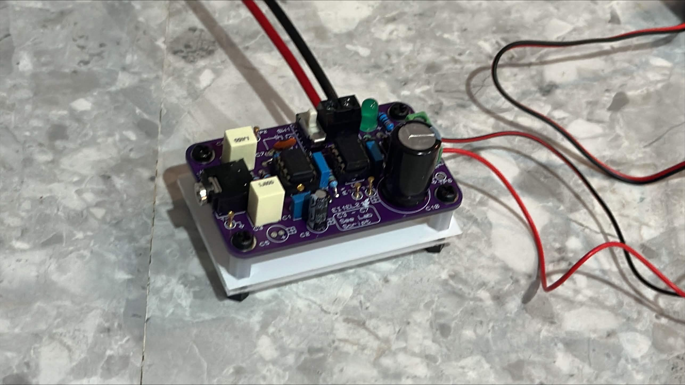

# Two-Stage Audio Amplifier

[](CHANGELOG.md)
[](LICENSE)
[](CHANGELOG.md)
[](https://doi.org/10.5281/zenodo.21903757)

This two-stage audio amplifier takes a line-level audio signal from a mobile phone and drives an 8 Ω speaker. The design was taken from initial hand calculations through Proteus SPICE simulation, breadboard prototyping on both dual and single supply and a final custom PCB.

## Final Assembly

<p align="center">
  
</p>

---

## Documentation Hub

<p align="center">
  <a href="DOCUMENTATION.md">Documentation</a> &nbsp;•&nbsp;
  <a href="FAQ.md">FAQ</a> &nbsp;•&nbsp;
  <a href="media/GALLERY.md">Gallery</a> &nbsp;•&nbsp;
  <a href="report/REPORT.md">Full Report</a> &nbsp;•&nbsp;
  <a href="report/JOURNAL.md">Journal</a> &nbsp;•&nbsp;
  <a href="CONTRIBUTING.md">Contributing</a> &nbsp;•&nbsp;
  <a href="CITATION.cff">Citation</a>
</p>

---

## Overview

The amplifier is two cascaded stages:

- **Stage 1 (TL071 active band-pass filter):** provides frequency selectivity across the human hearing range (5 Hz to 28.54 kHz) and voltage gain, bringing the 0.87 Vpp phone output up to 3 Vpp.
- **Stage 2 (OPA551 unity-gain buffer):** replicates the Stage 1 output voltage at high current, driving the 8 Ω speaker without adding further gain.

---

## Specifications

| Parameter | Value |
|---|---|
| Input source | iPhone 14 Pro Max |
| Input voltage | 0.872 Vpp at 440 Hz |
| Output voltage | 3 Vpp at 440 Hz |
| Speaker load | 8 Ω |
| Lower cutoff frequency | 5 Hz |
| Upper cutoff frequency | 28.54 kHz |
| Stage 1 IC | TL071CP |
| Stage 2 IC | OPA551PA |
| Feedback resistor | 82 kΩ |
| Supply configuration | Single supply |

---

## Results

PCB measurements at 440 Hz:

| Stage | Input | Output | Notes |
|---|---|---|---|
| Stage 1 (TL071 active filter) | 0.868 Vpp | 3.000 Vpp | Meets 3 Vpp target |
| Stage 2 (OPA551 buffer) | 0.872 Vpp | 2.980 Vpp | Unity gain confirmed |

Frequency response was verified across the full audio band on both breadboard and PCB. Full results with simulation comparison are in [DOCUMENTATION.md](DOCUMENTATION.md#12-results).

---

## Tech Stack

<div align="center">

|  |  |  |  |  |  |
|:---:|:---:|:---:|:---:|:---:|:---:|
| **Proteus** | **Git** | **GitHub** | **VS Code** | **Excel** | **Word** |

</div>

---

## Equipment

| Tool | Model | Purpose |
|---|---|---|
| Oscilloscope | Tektronix TBS1052C | Waveform capture and peak-to-peak voltage measurement |
| Function generator | Hameg HM8030 | Generating sine wave test signals for frequency response measurements |
| Audio source | iPhone 14 Pro Max | 440 Hz sine wave input for amplifier characterisation and testing |
| DC power supply | Dual-output bench PSU | Providing split supply (±15 V) for breadboard op-amp testing |
| Breadboard | 830-point | Dual supply and single supply circuit prototyping |
| Multimeter | - | Verifying virtual ground bias voltage before fitting ICs |
| Soldering iron | - | PCB component assembly and rework |

---

## Repository Structure

```
two-stage-audio-amplifier/
├── design/
│   └── proteus/
│       └── exports/       Schematic, PCB layout and simulation exports (PNG)
├── media/
│   ├── images/             Circuit figures, PCB photographs and oscilloscope traces
│   ├── block-diagrams/     System block diagrams and design flowcharts
│   ├── assets/             Icons used in this README
│   └── GALLERY.md          Curated image gallery with descriptions
├── report/
│   ├── REPORT.md           Full technical report in markdown
│   └── JOURNAL.md          Project retrospective and build journal
├── DOCUMENTATION.md        Complete technical reference
├── FAQ.md                  Frequently asked questions
├── CONTRIBUTING.md         Commit and workflow standards
├── NOTICE.md               Third-party media attribution
└── LICENSE                 CC BY-NC-ND 4.0
```

---

## Citing This Work

> [!NOTE]
> This repository is registered with Zenodo and has a permanent, citable DOI: [10.5281/zenodo.21903757](https://doi.org/10.5281/zenodo.21903757). See [CITATION.cff](CITATION.cff) for the full citation. The "Cite this repository" option on GitHub can also be used.

## Contact

> [!TIP]
> This project is maintained by Isaac "Zac" Adjei. Questions about it can be directed to any of the following:
>
> - GitHub: [zaccesss](https://github.com/zaccesss)
> - Website: [isaacadjei.me](https://isaacadjei.me)
> - Email: [eng@isaacadjei.me](mailto:eng@isaacadjei.me)

<p align="center">
  <b>Project Status:</b> Completed &nbsp;|&nbsp; <b>Last Updated:</b> August 2026
</p>
