# Two-Stage Audio Amplifier — Technical Report

**Author:** Isaac Adjei  
**Date:** March 2026

> [README.md](../README.md) &nbsp;|&nbsp; [DOCUMENTATION.md](../DOCUMENTATION.md) &nbsp;|&nbsp; [media/GALLERY.md](../media/GALLERY.md)

---

## Table of Contents

- [Abstract](#abstract)
- [1. Introduction](#1-introduction)
- [2. Technical Background](#2-technical-background)
  - [2.1 Human Hearing Range and Stereo vs Mono Audio](#21-human-hearing-range-and-stereo-vs-mono-audio)
  - [2.2 Active Band-Pass Filters](#22-active-band-pass-filters)
  - [2.3 The TL071 Operational Amplifier](#23-the-tl071-operational-amplifier)
  - [2.4 The TL071 as an Inverting Summing Active Band-Pass Filter](#24-the-tl071-as-an-inverting-summing-active-band-pass-filter)
  - [2.5 The OPA551 Operational Amplifier](#25-the-opa551-operational-amplifier)
  - [2.6 The OPA551 as a Unity-Gain Voltage Follower](#26-the-opa551-as-a-unity-gain-voltage-follower)
  - [2.7 Two-Stage Amplifier Architecture](#27-two-stage-amplifier-architecture)
  - [2.8 Single-Supply Operation](#28-single-supply-operation)
- [3. Design Description](#3-design-description)
  - [3.1 Technical Specifications](#31-technical-specifications)
  - [3.2 System Overview](#32-system-overview)
  - [3.3 Design Calculations](#33-design-calculations)
  - [3.4 Detailed Circuit Description](#34-detailed-circuit-description)
  - [3.5 PCB Design](#35-pcb-design)
  - [3.6 3D Model](#36-3d-model)
- [4. Results](#4-results)
  - [4.1 Breadboard Prototype Testing](#41-breadboard-prototype-testing)
  - [4.2 PCB Testing](#42-pcb-testing)
  - [4.3 Final Assembly](#43-final-assembly)
  - [4.4 Evaluation and Conclusions](#44-evaluation-and-conclusions)
- [5. References](#5-references)
- [Appendix A: Bill of Materials](#appendix-a-bill-of-materials)
- [Appendix B: Full Circuit Schematic](#appendix-b-full-circuit-schematic)

---

## Abstract

This report describes the design, simulation, testing and implementation of a two-stage audio amplifier optimised for an iPhone 14 Pro Max with a 0.872 Vpp input. A TL071 (Stage 1) performs stereo-to-mono summing, provides 10.67 dB gain and achieves a passband from 6.63 Hz to 28.54 kHz. An OPA551 (Stage 2) drives an 8 Ω speaker at 3 Vpp from a 9 V to 12 V single supply. The amplifier is implemented on a PCB mounted on an acrylic baseplate.

---

## 1. Introduction

This report describes the design, simulation, testing and implementation of a two-stage audio amplifier capable of accepting an audio input signal from a mobile phone and amplifying it to drive an external speaker. The amplifier was optimised for use with an iPhone 14 Pro Max, with a design input level of 0.872 Vpp at volume step 15 of 16, corresponding to 70% of the maximum measured output at 440 Hz. The target output is 3 Vpp across an 8 Ω speaker load. The system operates from either a 12 V DC power adapter or a 9 V PP3 battery, with an on/off switch and green LED indicator.

A two-stage architecture is employed because no single operational amplifier can simultaneously provide the required voltage gain with active band-pass filtering and the output current necessary to drive a low-impedance speaker load. The first stage uses a TL071 configured as an inverting summing active band-pass filter, combining the stereo left and right input channels into a mono signal, setting the voltage gain to 10.67 dB and defining the passband from 6.63 Hz to 28,540 Hz. The second stage uses an OPA551 configured as a unity-gain voltage follower to provide the current drive capability required to deliver 3 Vpp across the 8 Ω load whilst preserving the voltage established by the first stage.

Single-supply biasing at Vcc/2 is implemented throughout, with AC coupling capacitors blocking the DC offset from the signal path. The design process encompasses mobile phone output characterisation, gain and filter component calculations, dual-supply and single-supply simulation in Proteus, breadboard prototyping, PCB design and fabrication and final hardware testing.

---

## 2. Technical Background

### 2.1 Human Hearing Range and Stereo vs Mono Audio

The human auditory system can perceive sound across a frequency range of approximately 20 Hz to 20 kHz, although this range varies between individuals and typically narrows with age [3, 11, 12]. Within this audible spectrum, different frequency bands contribute distinct perceptual qualities to sound reproduction. Frequencies in the lower portion of the spectrum, broadly from 20 Hz to approximately 300 Hz, are perceived as bass. The mid-range, spanning approximately 300 Hz to 4 kHz, contains the fundamental frequencies of the human voice and most melodic instruments. The upper portion, from approximately 4 kHz to 20 kHz, is perceived as treble, encompassing the high-frequency content responsible for clarity and brightness of audio [3].

Consumer audio devices produce stereo audio output consisting of two independent channels, left and right, which carry slightly different audio content [4]. Where a stereo input is to be reproduced through a single mono loudspeaker, the two channels must be combined into a single mono signal. This process is referred to as stereo-to-mono summing and is commonly implemented using an inverting summing amplifier configuration, in which the left and right input signals are each connected to the inverting input of an operational amplifier through separate input resistors of equal value [3].

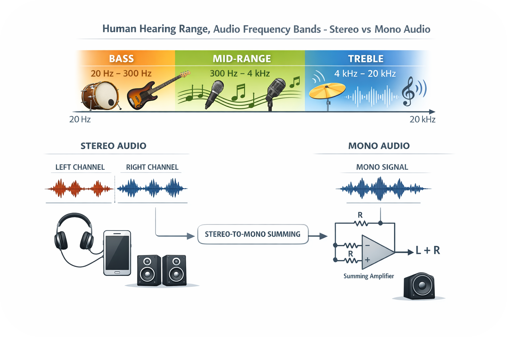

### 2.2 Active Band-Pass Filters

A band-pass filter passes signals between a lower cut-off frequency fL and an upper cut-off frequency fH whilst attenuating all frequencies outside that range [3]. The frequency response of an ideal band-pass filter is shown in Figure 1. The two cut-off frequencies are defined as the points at which the output signal power falls to half of its maximum value, corresponding to a reduction in voltage gain of 3 dB below the maximum passband gain [4].

The bandwidth of the filter is defined in Equation 1:

```
BW = fH - fL                                                             (1)
```

where BW is the bandwidth in Hz, fH is the upper cut-off frequency in Hz and fL is the lower cut-off frequency in Hz.

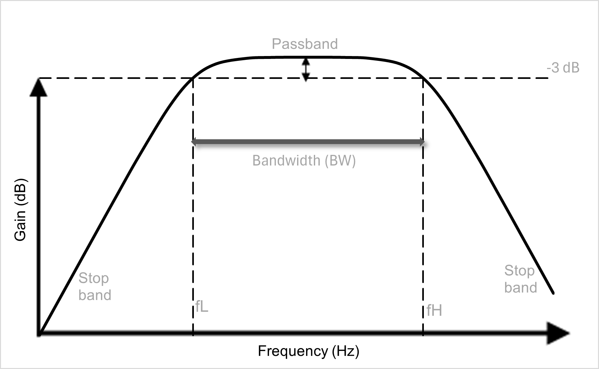

A passive band-pass filter constructed using only resistors and capacitors attenuates the signal within the passband as well as outside it, resulting in a voltage gain of less than unity [3]. An active band-pass filter incorporates an operational amplifier, which provides gain within the passband and allows the overall voltage gain to be set to a value greater than unity [6]. The operational amplifier also provides a low output impedance, isolating the filter from the load and preventing the load from affecting the frequency response [4].

When negative feedback is applied, the closed-loop gain and frequency response are determined primarily by the external components rather than by the operational amplifier itself, provided the open-loop gain is sufficiently large [3].

The lower cut-off frequency of an active band-pass filter is determined by a high-pass RC network at the input:

```
fL = 1 / (2π × Ri × Ci)                                                 (2)
```

where fL is the lower cut-off frequency in Hz, Ri is the input resistance in ohms and Ci is the input capacitance in farads.

The upper cut-off frequency is determined by a low-pass RC network in the feedback path:

```
fH = 1 / (2π × Rf × Cf)                                                 (3)
```

where fH is the upper cut-off frequency in Hz, Rf is the feedback resistance in ohms and Cf is the feedback capacitance in farads.

The passband voltage gain is determined by the ratio of feedback to input resistance:

```
Av = -(Rf / Ri)                                                          (4)
```

where Av is the voltage gain and the negative sign indicates phase inversion at the output [3].

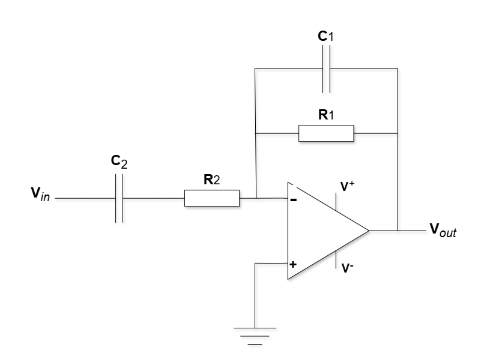

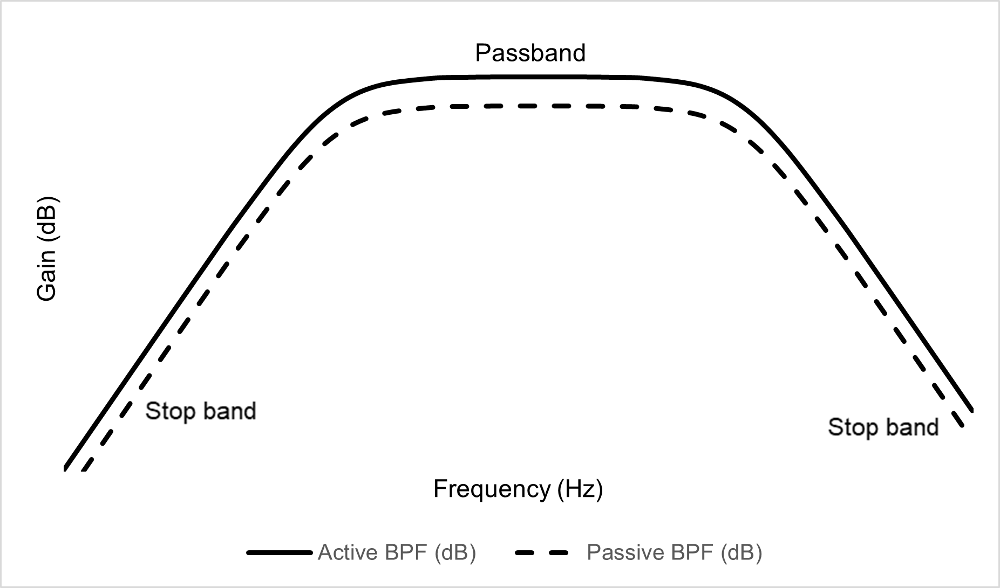

### 2.3 The TL071 Operational Amplifier

The TL071 is a general-purpose JFET-input operational amplifier [1]. The JFET input stage provides a high input impedance and an extremely low input bias current, minimising the loading effect on preceding signal sources [1]. The device is unity-gain stable and has a gain-bandwidth product of approximately 3 MHz and a slew rate of 13 V/µs [1]. The low input noise of 18 nV/√Hz and total harmonic distortion of 0.003% are important parameters for high-fidelity audio reproduction [1]. The TL071 operates from a supply voltage range of ±2.25 V to ±18 V, making it suitable for both dual-supply and single-supply configurations [1].

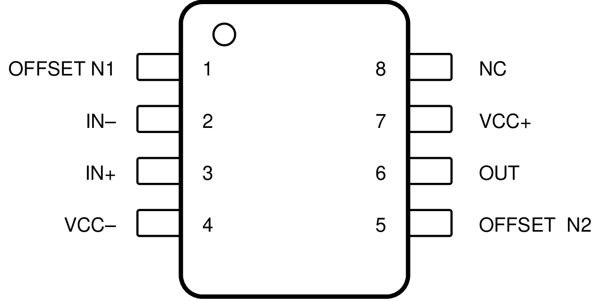

### 2.4 The TL071 as an Inverting Summing Active Band-Pass Filter

The TL071 may be configured as an inverting summing amplifier by connecting multiple input signals to the inverting input terminal through separate input resistors of equal value [7]. In this configuration, the output voltage is proportional to the inverted sum of all input signals, weighted by the ratio of the feedback resistance to the respective input resistance [3]. This property is used in the present design to combine the left and right channels of a stereo audio signal into a single mono signal.

The frequency-selective behaviour is achieved by incorporating RC networks at both the input and the feedback path. A series RC network at the input acts as a high-pass filter, attenuating signals below fL. A parallel RC network in the feedback path acts as a low-pass filter, attenuating signals above fH. The combination produces a band-pass frequency response [7].

### 2.5 The OPA551 Operational Amplifier

The OPA551 is a high-voltage, high-current operational amplifier designed for applications requiring large output current capability [2]. It can supply a continuous output current of up to ±200 mA, making it suitable for directly driving low-impedance loads such as loudspeakers without an additional discrete output stage [2]. The OPA551 has a gain-bandwidth product of 3 MHz and a slew rate of ±15 V/µs [2]. The device is unity-gain stable and operates from a supply voltage range of ±4 V to ±30 V [2].

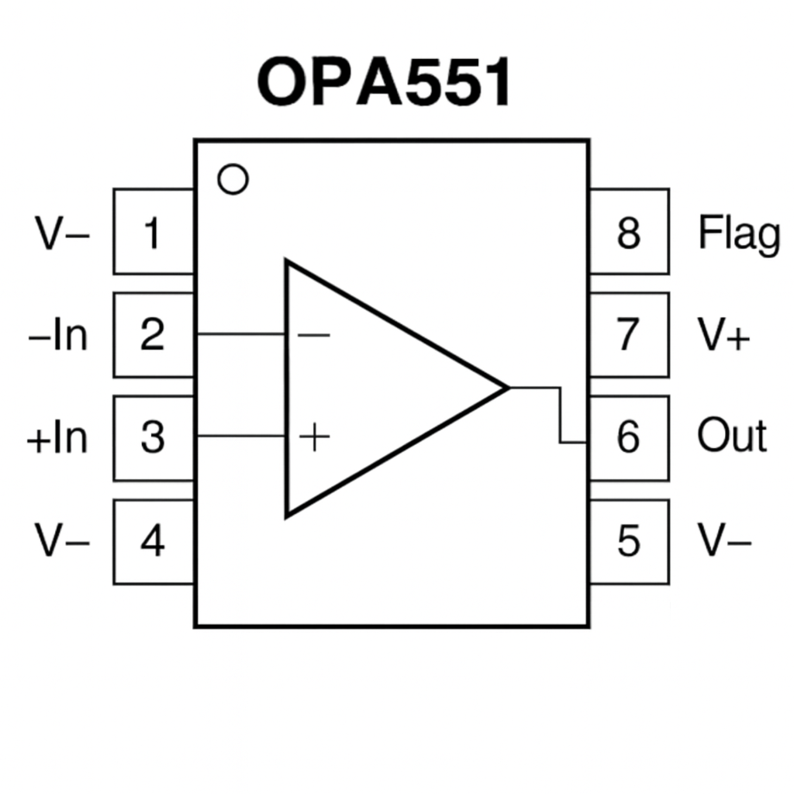

### 2.6 The OPA551 as a Unity-Gain Voltage Follower

The OPA551 is connected in a unity-gain voltage follower configuration by connecting the output terminal directly to the inverting input terminal, with the input signal applied to the non-inverting input terminal [2]:

```
Av = 1                                                                   (5)
```

The output voltage equals the input voltage in magnitude and phase. The purpose is not to provide voltage gain but to provide current gain. The TL071 active filter stage produces a voltage signal at the required amplitude and frequency response but cannot supply the output current necessary to drive an 8 Ω loudspeaker [1]. The OPA551 voltage follower transfers the voltage signal to the load whilst supplying the required output current from its own supply rails [2].

### 2.7 Two-Stage Amplifier Architecture

The two-stage architecture arises from the differing electrical characteristics of the TL071 and OPA551. The TL071 is well suited to filtering and gain setting due to its low noise and JFET input stage, but its output current capability is limited to approximately ±10 mA [1]. This is insufficient to drive an 8 Ω loudspeaker at the required output voltage. The OPA551 addresses this limitation with an output current capability of up to ±200 mA [2]. By combining the TL071 as the signal processing stage with the OPA551 as the current amplification stage, the design exploits the complementary strengths of both devices [7].

### 2.8 Single-Supply Operation

Operational amplifiers are conventionally operated from a dual supply, which allows the output to swing symmetrically about zero volts [3]. Single-supply operation requires a virtual ground reference at half the supply voltage (Vcc/2), generated using a resistive voltage divider with a decoupling capacitor in parallel [8]. All signal voltages are referenced to the virtual ground, allowing the output to swing symmetrically about Vcc/2 [8]. AC coupling capacitors at the input and output block the DC bias voltage from the signal source and load [3]. Without single-supply biasing and AC coupling, negative half-cycles would be clipped as the output cannot swing below 0 V [8].

---

## 3. Design Description

### 3.1 Technical Specifications

**Table 1: Electrical specifications of the two-stage audio amplifier**

| Parameter | Value | Notes |
|---|---|---|
| Input signal | 0.872 Vpp | iPhone 14 Pro Max, volume step 15 of 16 at 440 Hz, 70% of maximum output |
| Supply voltage | 9 V or 12 V | 9 V PP3 battery or 12 V DC adapter |
| Lower cut-off frequency | Target: 5 Hz / Actual: 6.63 Hz | Limited by available stock capacitor C2 = 1 µF |
| Upper cut-off frequency | Target: 29 kHz / Actual: 28.54 kHz | Limited by available stock capacitor C1 = 68 pF |
| Measured gain | Target: 10.73 dB / Actual: 10.67 dB | Voltage gain ratio 3.42 V/V; R1 = 82 kΩ given; R2 = 24 kΩ nearest stock value |
| Target output voltage | 3 Vpp | Across 8 Ω speaker load |
| Output power | 281 mW | P = Vpp² / (8 × R) = 9 / 64 |
| Speaker load | 8 Ω | Impedance approximated as resistive |
| Maximum output current | ±200 mA | OPA551PA rated continuous output current [2] |
| Key ICs | TL071CP, OPA551PA | Stage 1: TL071 active filter; Stage 2: OPA551 unity-gain buffer |
| Volume control | iPhone 14 Pro Max (built-in) | Eliminates need for hardware potentiometer |
| Power switch | SPST slide switch SW1 | Passive; controls power rail |
| LED indicator | Green LED D1 | Active; series resistor R6 = 3.3 kΩ limits forward current |
| PCB dimensions | 65 mm × 40 mm | Two-layer PCB designed in Proteus |
| Enclosure | Acrylic mounting plate | With speaker grille aperture |
| PCB mounting | M3 nylon hex standoffs | M3 20 mm screws, M3 6 mm nuts and washers |

### 3.2 System Overview

The overall architecture of the two-stage audio amplifier is presented in Figure 6. The system accepts a stereo audio input from a 3.5 mm jack socket connected to an iPhone 14 Pro Max and produces a mono amplified output for an 8 Ω speaker. Power is supplied via either a 9 V PP3 battery or a 12 V DC power adapter, passing through an on/off slide switch and a green power indicator LED before being distributed to both amplifier stages. The mobile phone and speaker are external to the amplifier system.

The first stage (TL071) combines the left and right stereo channels into a single mono signal, applies voltage gain and restricts the passband to the desired frequency range. The second stage (OPA551) provides the current drive capability necessary to deliver 3 Vpp across the 8 Ω speaker load without adding voltage gain. Signal flow is left to right; power is distributed from the power input block downward to both stages.

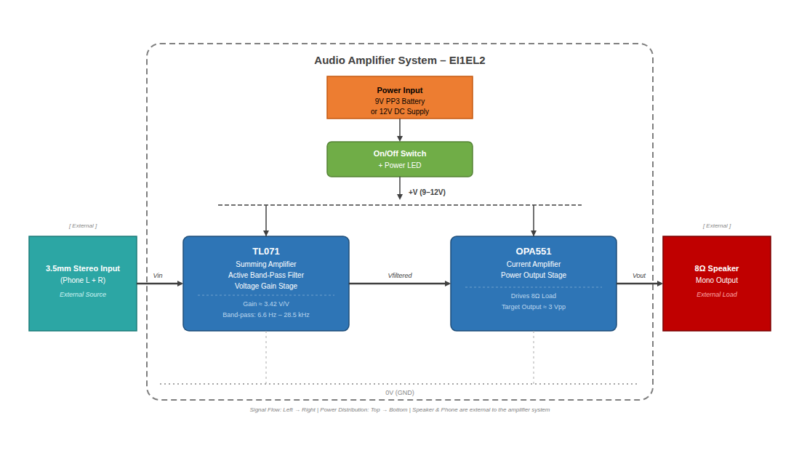

### 3.3 Design Calculations

The iPhone 14 Pro Max was characterised by measuring the output voltage at 440 Hz across all 16 volume steps. A frequency of 440 Hz was selected as it corresponds to the international standard musical pitch A4, providing a consistent and reproducible test signal [3]. The design input level was selected at 70% of the maximum measured output of 1.224 Vpp, giving a target of 0.857 Vpp. Volume step 15 of 16 produced an output of 0.872 Vpp, representing an error of 1.77% from the 70% target. This value was adopted as the design input voltage.


**Voltage gain:**

The required voltage gain was calculated using Equation 6 [13]:

```
Av = Vout / Vin = 3 / 0.872 = 3.44 V/V                                  (6)
```

Converting to decibels:

```
Av(dB) = 20 × log10(3.44) = 10.73 dB                                    (7)
```

**Input resistor R2:**

The feedback resistor R1 was given as a fixed value of 82 kΩ. The required input resistor R2 was calculated from Equation 4 rearranged:

```
R2 = R1 / Av = 82000 / 3.44 = 23.84 kΩ                                  (8)
```

The nearest preferred stock value of 24 kΩ was selected for R2, giving an actual gain:

```
Av(actual) = R1 / R2 = 82000 / 24000 = 3.42 V/V = 10.67 dB              (9)
```

R1 and R2 carry a tolerance of ±1%, meaning the actual gain may vary between 3.39 V/V and 3.46 V/V, corresponding to a worst-case range of 10.60 dB to 10.78 dB [13].

**Lower cut-off frequency and capacitor C2:**

The lower cut-off frequency fL was given as a fixed value of 5 Hz. The required capacitance C2 was calculated:

```
C2 = 1 / (2π × R2 × fL) = 1 / (2π × 24000 × 5) = 1.326 µF              (10)
```

The nearest stock value of 1 µF was selected for C2, giving an actual lower cut-off frequency:

```
fL(actual) = 1 / (2π × R2 × C2) = 1 / (2π × 24000 × 1×10⁻⁶) = 6.63 Hz (11)
```

**Upper cut-off frequency and capacitor C1:**

The upper cut-off frequency fH was selected as 29 kHz, within the permitted design range. The required capacitance C1 was calculated:

```
C1 = 1 / (2π × R1 × fH) = 1 / (2π × 82000 × 29000) = 66.93 pF          (12)
```

The nearest stock value of 68 pF was selected for C1, giving an actual upper cut-off frequency:

```
fH(actual) = 1 / (2π × R1 × C1) = 1 / (2π × 82000 × 68×10⁻¹²)
           = 28,542 Hz                                                   (13)
```

**Output power:**

```
P = Vpp² / (8 × R) = 9 / (8 × 8) = 0.281 W = 281 mW                    (14)
```

**LED current-limiting resistor R6:**

```
R6 = (Vs - Vf) / If = (12 - 2.1) / 0.003 = 9.9 / 0.003 = 3300 Ω        (15)
```

A supply voltage of 12 V was used for worst-case conditions. A forward voltage of 2.1 V was assumed for the green LED D1. The nearest stock value of 3.3 kΩ was selected, providing an operating current of approximately 3 mA.

**Output coupling capacitor cut-off frequency:**

The output coupling capacitor C8 forms a high-pass RC filter with the speaker load:

```
fC = 1 / (2π × C8 × RL) = 1 / (2π × 2200×10⁻⁶ × 8) = 9.05 Hz          (16)
```

This cut-off frequency of 9.05 Hz is below the active filter lower cut-off of 6.63 Hz, ensuring C8 does not restrict audible performance within the intended passband.

### 3.4 Detailed Circuit Description

The first stage is implemented using U1, a TL071CP configured as an inverting summing active band-pass filter. The audio signal from the iPhone 14 Pro Max is connected via the 3.5 mm stereo jack socket J1. The left channel passes through C2 (1 µF) and R2 (24 kΩ) in series, whilst the right channel passes through C6 (1 µF) and R5 (24 kΩ) in series, both connecting to the inverting input of U1 to sum the stereo channels into a mono signal. The matched 24 kΩ resistors ensure both channels present identical input impedance and contribute equal gain to the summed mono output. C2 and C6 are polyester film capacitors, selected for their non-polarised construction and superior stability compared to electrolytic types for AC coupling [3].

Feedback resistor R1 (82 kΩ) is connected between output pin 6 and inverting input pin 2 of U1, with the voltage gain determined by the ratio of R1 to R2 as shown in Equation 9, giving 3.42 V/V or 10.67 dB. Capacitor C1 (68 pF) is connected in parallel with R1, with the upper cut-off frequency determined by R1 and C1 as calculated in Equation 13, giving fH = 28,542 Hz. The lower cut-off frequency is determined by R2 and C2 as calculated in Equation 11, giving fL = 6.63 Hz.

Single-supply operation is achieved by biasing pin 3 of U1 to half the supply voltage via the potential divider formed by R3 and R4, each of 24 kΩ, giving approximately 4.5 V on a 9 V supply. Power supply decoupling capacitors C3 and C4 (100 nF ceramic each) are placed close to the supply pins of U1, and C7 (100 nF) provides equivalent decoupling at U2. C5 (10 µF electrolytic) is a bulk decoupling capacitor at U2, suppressing lower-frequency noise and providing a local charge reservoir for the transient current demands of the OPA551PA [2].

The second stage uses U2, an OPA551PA configured as a unity-gain voltage follower with its output connected directly to its inverting input. The output coupling capacitor C8 (2200 µF) is connected in series between pin 6 of U2 and the speaker output terminal LS1. This blocks the DC bias voltage from the speaker load, which would otherwise waste power and potentially damage the voice coil.

Diodes D2 and D3, both 1N4007 silicon rectifier diodes, provide protection against reverse polarity connection of the power supply [4, 5]. D3 is in series with the positive supply rail, becoming reverse biased under reversed polarity. D2 is connected between the output of U2 and ground, clamping any negative voltage spike to approximately -0.7 V.

The power indicator LED D1 is connected in series with R6 (3.3 kΩ) between the positive supply rail and ground. When SW1 is closed, current flows through R6 and D1, providing visual indication that the amplifier is powered.

In the Proteus simulation environment, the loudspeaker LS1 is replaced by a fixed resistor R7 (8.2 Ω) as the simulation load, as Proteus does not accurately model the frequency-dependent impedance of a real loudspeaker.

### 3.5 PCB Design

The printed circuit board was designed in Proteus PCB Layout with overall dimensions of 65 mm × 40 mm, as shown in Figures 10 and 11. Component placement followed the principle of signal flow from left to right, with the audio input jack socket J1 on the left edge, the power supply terminal block on the top right edge and the speaker output on the bottom right edge. The power switch SW1 and LED indicator D1 are positioned along the top edge for easy user access.

The two integrated circuits U1 and U2 are placed centrally on the board, with U1 to the left of U2 in accordance with signal flow. Decoupling capacitors C3 and C7 (100 nF) are placed immediately adjacent to the supply pins of U1 and U2 respectively. This short connection is essential for effective suppression of high-frequency noise, as any additional track length introduces parasitic inductance that reduces decoupling effectiveness [7].

Signal tracks were routed at a width of T30 (0.762 mm) and power supply tracks at T40 (1.016 mm) to accommodate higher supply rail currents and reduce resistive voltage drop. Track junctions were routed using mitred corners rather than 90° bends wherever possible, as sharp corners concentrate current density and can introduce interference into sensitive signal tracks [6]. A copper pour was applied to the bottom layer to form a continuous ground plane, reducing ground return impedance and improving electromagnetic compatibility.

The PCB design was verified using the Proteus Design Rule Check, which returned no DRC errors.

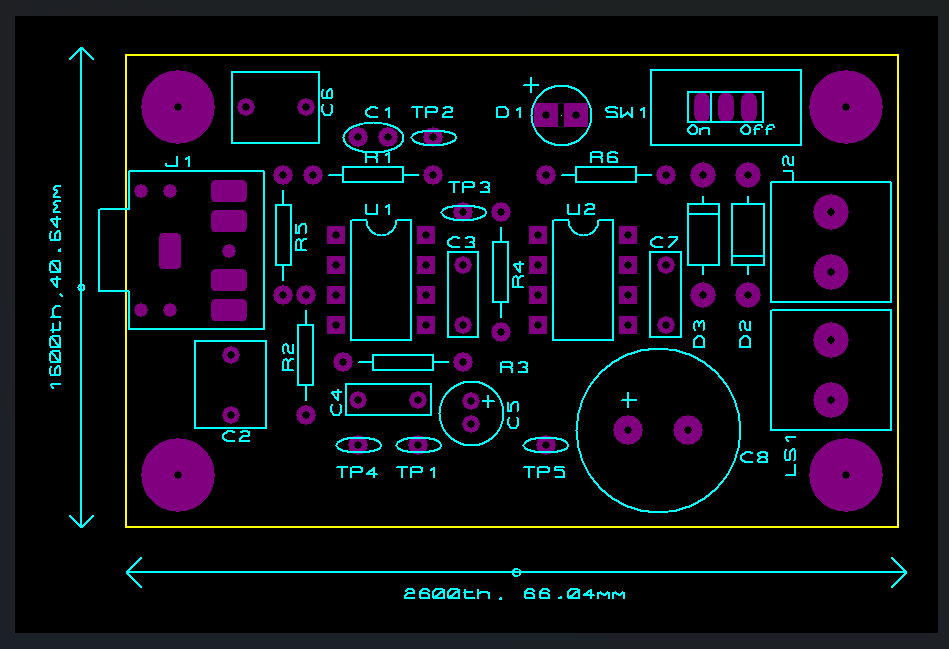

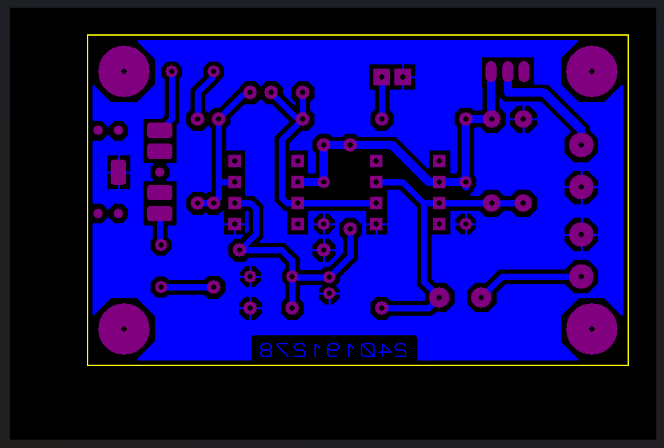

### 3.6 3D Model

A three-dimensional visualisation of the PCB was generated using the Proteus 3D Visualiser, as shown in Figure 12. The model confirms that all through-hole components are correctly orientated, with U1 and U2 positioned centrally as dual in-line packages. The electrolytic capacitors C5 and C8 are clearly visible due to their physical height; C8 (2200 µF) is the tallest component and its height must be considered when fitting the PCB within the enclosure. The four mounting holes at the corners allow the PCB to be secured to the acrylic base plate using M3 screws and spacers.

<p align="center">
  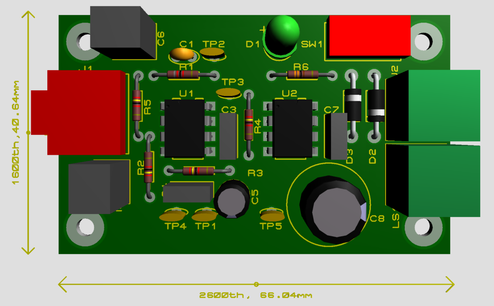
  &nbsp;
  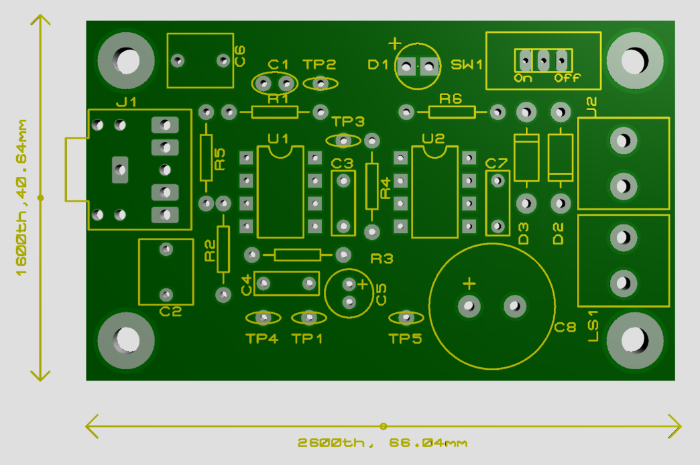
</p>

<p align="center">
  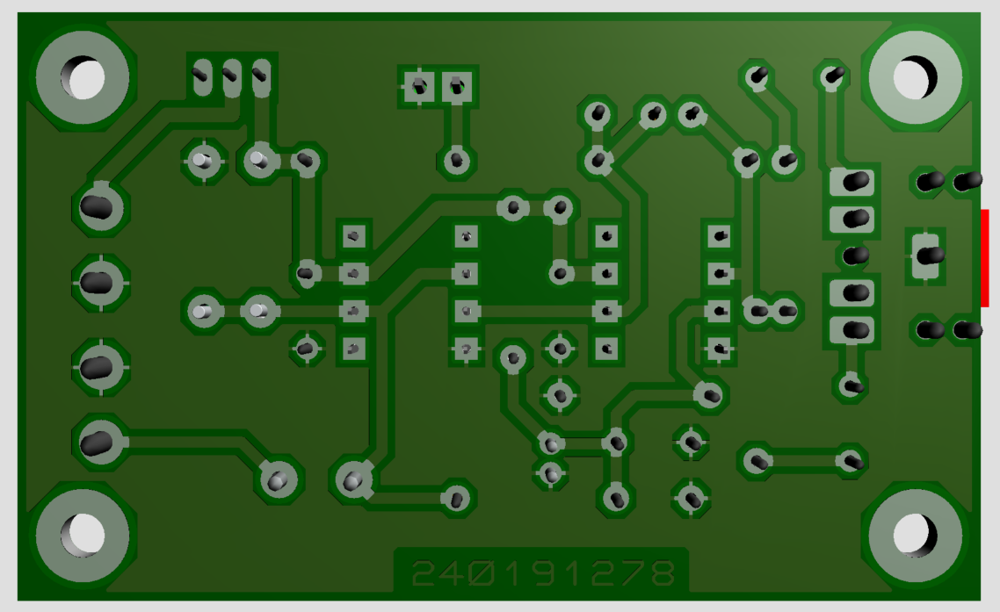
  &nbsp;
  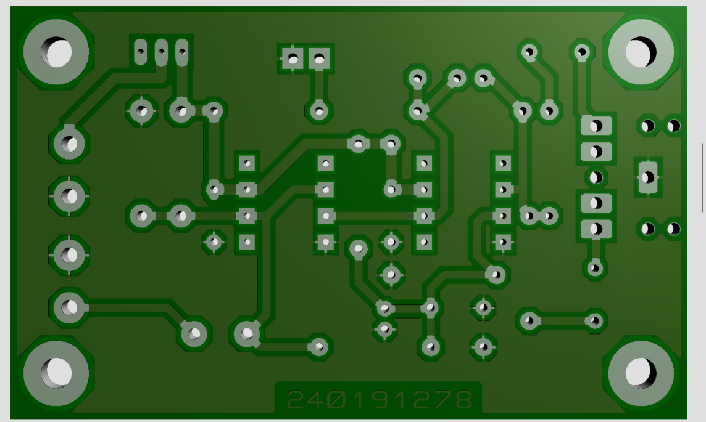
</p>

---

## 4. Results

All frequency response measurements were performed using a Hameg HM8030 function generator and a Tektronix TBS1052C two-channel digital oscilloscope set to DC coupling throughout. The input signal was maintained at approximately 0.872 Vpp and the gain at each frequency was calculated from the ratio of output to input peak-to-peak voltages and expressed in decibels.

For the dual-supply breadboard measurement, the first stage was powered from a dual ±9 V laboratory power supply with the output measured directly at pin 6 of U1. For the single-supply breadboard and PCB Stage 1 measurements, a 470 nF external capacitor was connected in series between the output of U1 and the oscilloscope to remove the 4.5 V DC offset, forming a high-pass network with a cut-off frequency of approximately 0.34 Hz. For the PCB Stage 2 measurement, load resistor R7 (8.2 Ω) was connected at the output and no external coupling capacitor was required as C8 (2200 µF) blocks the DC offset internally.

### 4.1 Breadboard Prototype Testing

The frequency response of the first amplifier stage was measured on breadboard with a dual ±9 V power supply. The simulated and measured results are shown in Figure 13. The simulated and measured midband gain at 440 Hz were both 10.67 dB, demonstrating exact agreement. The simulated lower cut-off frequency was 6.6 Hz, and the measured value was approximately 7.2 Hz, in close agreement with the calculated value of 6.63 Hz. The simulated upper cut-off frequency was 27.7 kHz, and the measured value was approximately 26.0 kHz. The small discrepancy between simulated and measured cut-off frequencies is attributable to component tolerances.

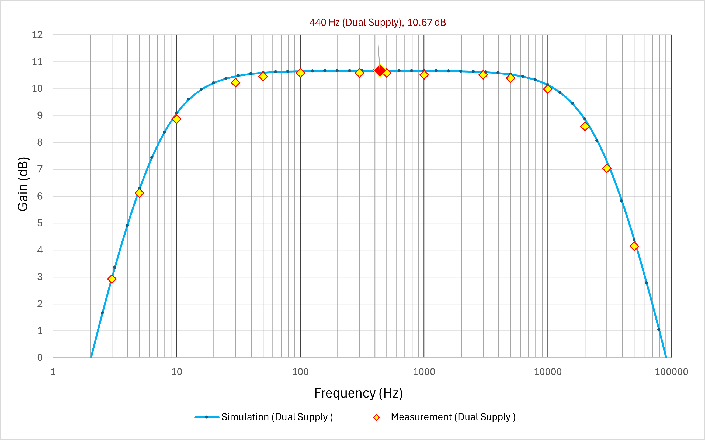

Figure 14 shows the simulated and measured frequency response of the complete amplifier on breadboard with a single 9 V power supply. The measured midband gain at 440 Hz was 10.78 dB, in close agreement with the calculated value of 10.67 dB. The measured lower cut-off frequency was approximately 6.8 Hz and the measured upper cut-off frequency was approximately 27.1 kHz.

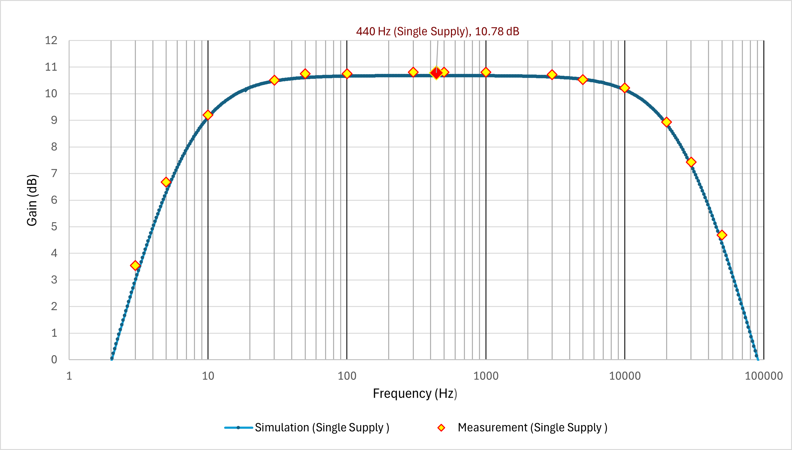

### 4.2 PCB Testing

The PCB was tested in two stages. Prior to fitting any integrated circuits, a multimeter was used to confirm that the virtual ground bias voltage of approximately 4.5 V was present at the non-inverting input pin 3 of U1. U1 was then fitted and a full frequency sweep from 1 Hz to 100 kHz was performed at the Stage 1 output at pin 6 of U1. U2 was then fitted without load resistor R7, and the 440 Hz output was verified at 3 Vpp with no clipping observed. Load resistor R7 (8.2 Ω) was then connected and a second full frequency sweep was performed at the Stage 2 output.

The simulated and measured results for both stages are shown in Figure 15.

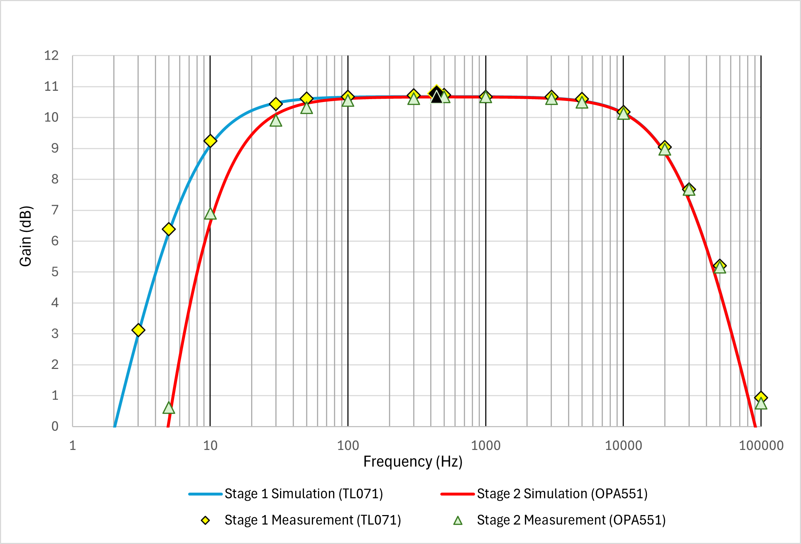

**Table 2: Comparison of calculated, simulated and measured amplifier performance parameters**

| Parameter | Calculated | Simulated | Dual Supply BB | Single Supply BB | PCB Stage 1 | PCB Stage 2 |
|---|---|---|---|---|---|---|
| Gain (dB) | 10.67 | 10.67 | ~10.58 | ~10.81 | ~10.73 | 10.67 |
| Lower cut-off (Hz) | 6.63 | 6.60 | ~7.2 | ~6.8 | ~6.9 | ~13.2 |
| Upper cut-off (kHz) | 28.54 | 27.7 | ~26.0 | ~27.1 | ~29.5 | ~30.0 |
| Bandwidth (kHz) | 28.53 | 27.7 | ~26.0 | ~27.1 | ~29.5 | ~30.0 |

The midband gain results show excellent consistency across all test conditions, with all measured values within 0.14 dB of the calculated value of 10.67 dB. The PCB Stage 2 lower cut-off of approximately 13.2 Hz is higher than the design value, as expected given the additional high-pass pole introduced by C8 (2200 µF) in series with load resistor R7 (8.2 Ω). The upper cut-off frequency shows good agreement across all conditions, the small upward shift being consistent with the negative tolerance of C1 (68 pF).

**Time-domain waveforms at 440 Hz:**

In Figure 16(c), CH1 records an input of 868 mVpp at 440 Hz and CH2 records a Stage 1 output of 3.000 Vpp measured via a 470 nF external coupling capacitor. The measured voltage gain at Stage 1 is therefore 3.000 / 0.868 = 3.456, equivalent to 10.77 dB.

In Figure 16(d), CH1 records an input of 872 mVpp and CH2 records a Stage 2 output of 2.980 Vpp. The voltage gain at Stage 2 is therefore 2.980 / 0.872 = 3.418, equivalent to 10.67 dB, in exact agreement with the calculated and simulated values.

<p align="center">
  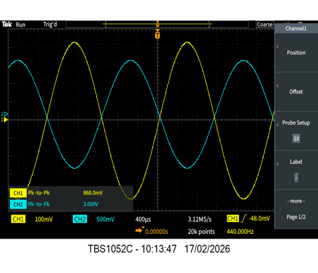
  &nbsp;
  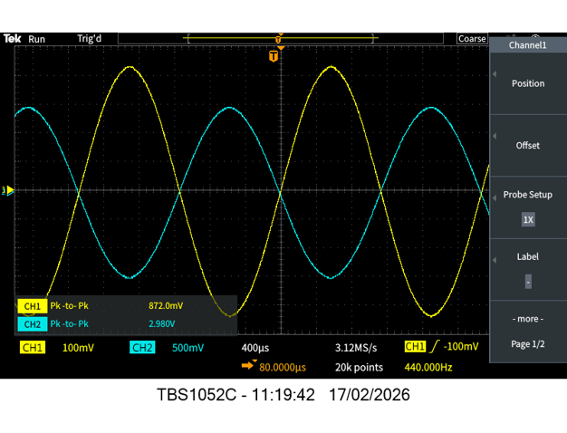
</p>

All four waveforms are clean, undistorted sinusoids at 440 Hz, confirming that both stages operate within their linear range and that the 3 Vpp output voltage target is met.

### 4.3 Final Assembly

The completed PCB assembly is presented in Figure 17. The PCB measures 65 mm × 40 mm with a purple solder mask finish, mounted onto a 3 mm acrylic baseplate using four M3 nylon standoffs. U1 and U2 are seated in DIP IC sockets to allow removal and replacement without desoldering. The completed assembly produced an audible 440 Hz tone from the speaker when driven from the iPhone 14 Pro Max at 70% of maximum volume, confirming that the mechanical and electrical assembly is functional.

<p align="center">
  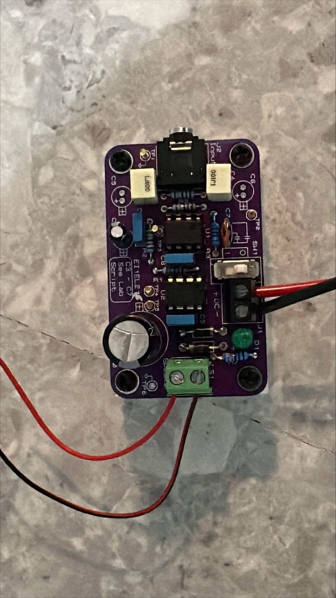
  &nbsp;
  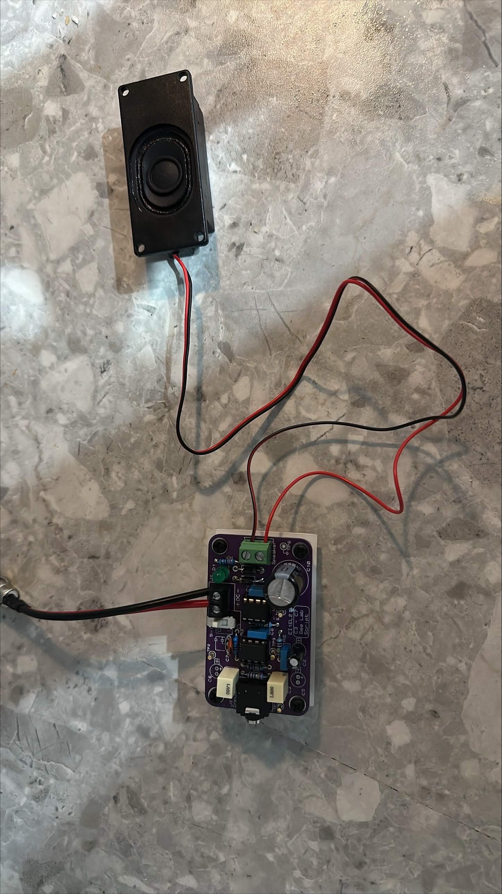
</p>

<p align="center">
  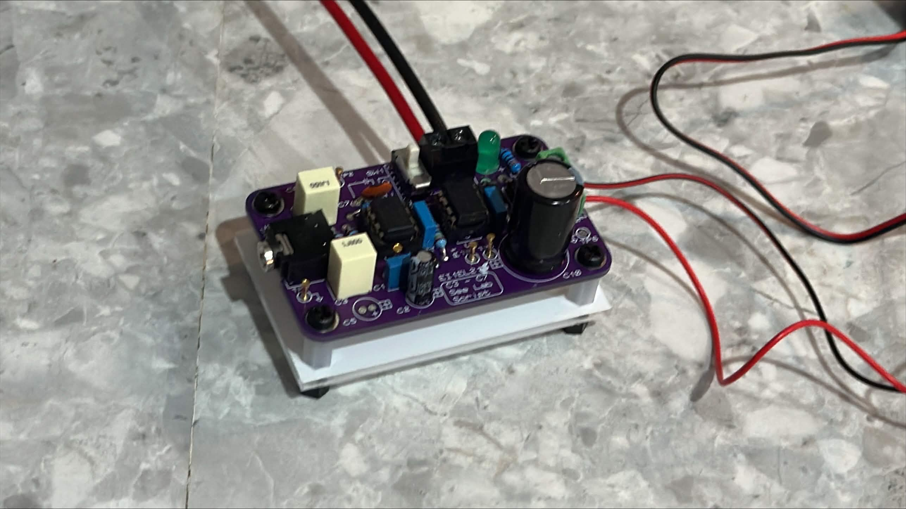
  &nbsp;
  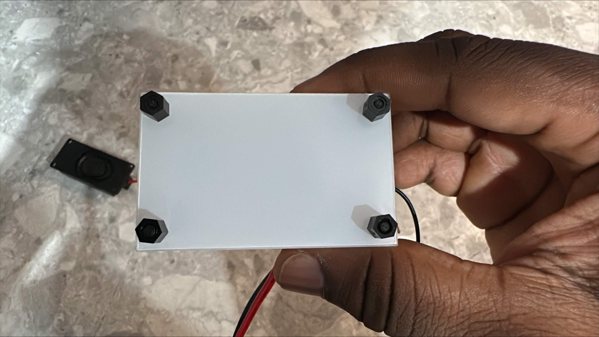
</p>

### 4.4 Evaluation and Conclusions

The design met all key performance targets across simulation and hardware testing. The voltage gain was consistent throughout, measuring approximately 10.58 dB on the dual-supply breadboard, 10.81 dB on the single-supply breadboard, 10.77 dB on PCB Stage 1 and 10.67 dB on PCB Stage 2, all within 0.14 dB of the calculated value of 10.67 dB. The 3 Vpp output target was met, with Stage 2 delivering 2.980 Vpp at 440 Hz on the PCB, representing agreement to within 0.67% of the design target.

The upper cut-off frequency showed close agreement across all conditions, with the PCB Stage 1 measurement of approximately 29.5 kHz and PCB Stage 2 measurement of approximately 30.0 kHz both consistent with the calculated value of 28.54 kHz, the small upward shift being attributable to the negative tolerance of C1 within its ±20% tolerance. The lower cut-off frequency of approximately 6.9 Hz on PCB Stage 1 agreed with the calculated value of 6.63 Hz to within 4.1%. All measured waveforms at 440 Hz were undistorted sinusoids, confirming linear operation throughout, and the phase inversion of 180° is consistent with the inverting amplifier topology of U1.

At the design output power of 281 mW delivered to the 8 Ω load, the OPA551 U2 operates well within its maximum continuous power dissipation rating and no thermal management measures were required [2].

Possible improvements for future iterations:

- Replace the screw terminal power input with a dedicated DC barrel jack to accommodate both a 12 V DC adapter and a 9 V PP3 battery clip, eliminating the risk of incorrect polarity connections
- Design a dedicated enclosure incorporating a speaker grille to protect the speaker cone whilst allowing sound to propagate freely
- Apply conformal coating to the finished PCB to improve moisture resistance and long-term solder joint reliability
- Replace the 3.5 mm jack input with a Bluetooth audio receiver module to eliminate the physical cable connection to the source device

---

## 5. References

[1] Texas Instruments, "TL071 JFET-Input Operational Amplifiers," SLOS080L, Texas Instruments, Dallas, TX, USA, Feb. 2014.

[2] Texas Instruments, "OPA551 High-Voltage, High-Current Operational Amplifier," SBOS100A, Texas Instruments, Dallas, TX, USA, Jan. 2004.

[3] N. Storey, *Electronics: A Systems Approach*, 6th ed. Harlow: Pearson, 2017.

[4] P. Horowitz and W. Hill, *The Art of Electronics*, 3rd ed. New York, NY, USA: Cambridge University Press, 2015.

[5] P. Scherz and S. Monk, *Practical Electronics for Inventors*, 4th ed. New York, NY, USA: McGraw-Hill, 2016.

[6] H. Zumbahlen, Ed., *Linear Circuit Design Handbook*. Burlington, MA, USA: Newnes/Elsevier, 2008.

[7] Texas Instruments, "Handbook of Operational Amplifier Applications," SBOA092B, Texas Instruments, Dallas, TX, USA, Sep. 2016.

[8] Texas Instruments, "A Single-Supply Op-Amp Circuit Collection," Application Report SLOA058, Texas Instruments, Dallas, TX, USA, Nov. 2000.

[9] R. Mancini, Ed., *Op Amps for Everyone*, Design Guide SLOD006B, Texas Instruments, Dallas, TX, USA, 2002.

[10] Texas Instruments, "Audio Amplifier Design," Application Report SLOA030, Texas Instruments, Dallas, TX, USA, Sep. 1999.

[11] O. Bishop, *Electronics*, 3rd ed. Amsterdam: Newnes/Elsevier, 2003.

[12] K. Brindley, *Starting Electronics*, 4th ed. Oxford: Newnes/Elsevier, 2011.

[13] J. O. Bird, *Engineering Mathematics*, 8th ed. London: Routledge, 2021.

---

## Appendix A: Bill of Materials

**Table 3: Bill of materials for the two-stage audio amplifier**

| Category | Qty | Designator(s) | Value | Description |
|---|---|---|---|---|
| Capacitors | 1 | C1 | 68 pF | Ceramic capacitor, upper cut-off frequency |
| Capacitors | 2 | C2, C6 | 1 µF | Polyester film capacitor, lower cut-off and input coupling |
| Capacitors | 3 | C3, C4, C7 | 100 nF | Polyester film capacitor, supply decoupling |
| Capacitors | 1 | C5 | 10 µF | Electrolytic capacitor, bias network decoupling |
| Capacitors | 1 | C8 | 2200 µF | Electrolytic capacitor, output DC blocking |
| Resistors | 1 | R1 | 82 kΩ | 0.25 W metal film, feedback resistor |
| Resistors | 4 | R2, R3, R4, R5 | 24 kΩ | 0.25 W metal film, gain, summing and bias network |
| Resistors | 1 | R6 | 3.3 kΩ | 0.25 W metal film, LED current limiting |
| Resistors | 1 | R7 | 8.2 Ω | 2 W metal film, simulation load resistor |
| ICs | 1 | U1 | TL071CP | JFET-input op-amp, active band-pass filter |
| ICs | 1 | U2 | OPA551PA | High-current op-amp, unity-gain output buffer |
| Diodes | 1 | D1 | LED (green) | Power indicator |
| Diodes | 2 | D2, D3 | 1N4007 | Rectifier diode, reverse polarity protection |
| Connectors | 1 | J1 | 3.5 mm jack | Stereo PCB jack socket, audio input |
| Connectors | 1 | J2 | 2-way terminal block | Speaker output |
| Mechanical | 1 | LS1 | 8 Ω speaker | Audio output load |
| Mechanical | 1 | SW1 | SPST slide switch | Power switch |
| Test points | 5 | TP1–TP5 | Test pins | Virtual ground, Stage 1 output, power, GND and general |

---

## Appendix B: Full Circuit Schematic

The full circuit schematic for the two-stage audio amplifier is presented below. The schematic was exported from Proteus and shows the complete circuit including all biasing, coupling, decoupling and protection components.

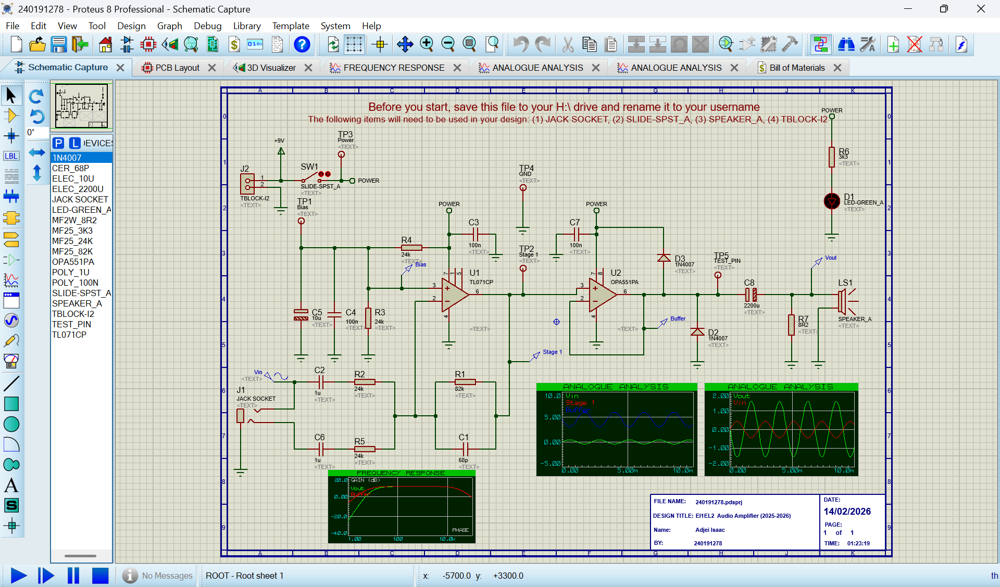
